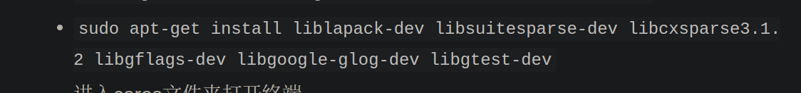

# 仿真

## 环境配置&#x20;

-   首先按照fast drone250指南第7章配置好环境

    glog另外装，

    [https://blog.csdn.net/kenstandlee/article/details/117031392](https://blog.csdn.net/kenstandlee/article/details/117031392 "https://blog.csdn.net/kenstandlee/article/details/117031392")

    libcxsparse3.1.2 换成libcxsparse3

    
-   Husky\_ws 小车模型和控制

    我已经放在autulanding\_ws的包里面了，不用单独装husky功能包，安装依赖即可

    参考文章&#x20;

    [(125条消息) ROS仿真环境配置Husky+32线激光雷达+深度相机+imu+gps\_zhhao1326的博客-CSDN博客](https://blog.csdn.net/weixin_42438635/article/details/125304796 "(125条消息) ROS仿真环境配置Husky+32线激光雷达+深度相机+imu+gps_zhhao1326的博客-CSDN博客")

    会报错，所以要依赖

    依赖

    参考文章&#x20;

    [How to use ros-noetic-husky? - ROS Answers: Open Source Q\&A Forum](https://answers.ros.org/question/385568/how-to-use-ros-noetic-husky/ "How to use ros-noetic-husky? - ROS Answers: Open Source Q\&A Forum")

    安装
    ```bash
    mkdir Husky_ws/src
    cd Husky_ws/src

    #下载指定分支HUSKY
    git clone -b noetic-devel https://github.com/husky/husky.git

    cd ..
    catkin_make
    ```
    ```bash
    sudo apt-get install ros-noetic-lms1xx 
    ```
    ```bash
    sudo apt-get install ros-noetic-robot-localization 
    ```
    ```bash
    sudo apt-get install ros-noetic-interactive-marker-twist-server 
    ```
    ```bash
    sudo apt-get install ros-noetic-joy
    ```
    ```bash
    sudo apt-get install ros-noetic-twist-mux  
    ```
    ```bash
    sudo apt-get install ros-noetic-teleop-twist-joy
    ```
    ```bash
    sudo apt-get install ros-noetic-dwa-local-planner 
    ```
    ```bash
    sudo apt-get install ros-noetic-velodyne-description 
    ```
    还是不能启动，把husky模型换成我的husky模型（已经集成在我的代码里）

    在xacro那里

    gazebo apriltag模型

    纹理添加在

    /usr/share/gazebo-11/media/materials/textures 和 .../materials/scripts

    启动
    ```bash
    roslaunch husky_gazebo husky_empty_world.launch
    # roslaunch husky_gazebo husky_playpen.launch
    #自定义的环境
    # roslaunch husky_gazebo husky_empty_world.launch world_name:=worlds/willowgarage.world

    rosrun turtlesim turtle_teleop_key turtle1/cmd_vel:=husky/cmd_vel

    ```
-   PX4-Autopilot PX4固件
    -   安装
        -   参考
            [(125条消息) Ubuntu20.04+MAVROS+PX4+Gazebo保姆级安装教程\_晨少的博客的博客-CSDN博客](https://blog.csdn.net/HuangChen666/article/details/128754106 "(125条消息) Ubuntu20.04+MAVROS+PX4+Gazebo保姆级安装教程_晨少的博客的博客-CSDN博客")
        ```bash
        pip install —upgrade  numpy
        ```
        ```bash
        git clone https://github.com/PX4/PX4-Autopilot.git --recursive
        ```
        ```bash
        cd PX4-Autopilot/
        git submodule update --init --recursive

        ```
        ```bash
        cd .. & bash ./PX4-Autopilot/Tools/setup/ubuntu.sh  

        ```
        重启
        ```bash
        make px4_sitl_default gazebo

        ```
        添加环境变量
        ```bash
        source ~/PX4-Autopilot/Tools/simulation/gazebo-classic/setup_gazebo.bash ~/PX4-Autopilot ~/PX4-Autopilot/build/px4_sitl_default
        export ROS_PACKAGE_PATH=$ROS_PACKAGE_PATH:~/PX4-Autopilot
        export ROS_PACKAGE_PATH=$ROS_PACKAGE_PATH:~/PX4-Autopilot/Tools/simulation/gazebo-classic/sitl_gazebo-classic

        ```
-   realsense 仿真工具

    已经集成在sim\_utils

    参考文章

    [https://blog.csdn.net/sinat\_16643223/article/details/120072154](https://blog.csdn.net/sinat_16643223/article/details/120072154 "https://blog.csdn.net/sinat_16643223/article/details/120072154")&#x20;
-   距离传感器仿真工具&#x20;

    用的是 单线的激光，使用lidar模型，但是插件改成laser的插件，参考问文章

    [https://discuss.px4.io/t/add-distance-sensor-to-drone-model-in-gazebo/28936](https://discuss.px4.io/t/add-distance-sensor-to-drone-model-in-gazebo/28936 "https://discuss.px4.io/t/add-distance-sensor-to-drone-model-in-gazebo/28936")
-   sdf 格式&#x20;

    学习一下基本语法，后面可能要改模型或者debug要用

    参考文章

    [https://zhuanlan.zhihu.com/p/129659674](https://zhuanlan.zhihu.com/p/129659674 "https://zhuanlan.zhihu.com/p/129659674")
-   serial库&#x20;

    sudo apt install ros-noetic-serial

    然后发现还是找不到lserial库，继续：

    get the code: git不下来在draft\_space里面的就是了

    git clone [https://github.com/nooploop-dev/serial.git](https://github.com/nooploop-dev/serial.git "https://github.com/nooploop-dev/serial.git")

    Build:

    make

    Build and run the tests:

    make test

    Install:

    sudo make install
-   apriltag包&#x20;

    apriltag\_ws放在主目录下，删掉build和devel,编译使用catkin\_make\_isolated

### 代码迁移修改&#x20;

-   启动文件修改&#x20;

    世界文件在sim\_node文件下的worlds里的empty\_default\_ground.world

    模型文件在sim\_node文件夹下models里的一大堆，主文件是fast330.sdf，里面包含了models文件夹下的其他模型文件

    环境启动文件在sim\_node文件夹下的lanuch下，simauto\_land.launch，修改里面的worlds路径和sdf路径为自己电脑上的绝对路径
-   模型配置路径修改 &#x20;

    sim\_node功能包的package.xml里面，export标签下
    ```xml
    <gazebo_ros gazebo_model_path="/home/anifan/hiauto-landing/autolanding_ws/src/sim_utils/sim_node/models"/> 
    ```
    改成自己电脑的绝对路径到：你的路径/autolanding\_ws/src/sim\_utils/sim\_node/models文件夹下（相对路径我不会改，谁会的教学一下）

## 编译&#x20;

#### 源文件编译顺序&#x20;

Note : 使用下面这个命令单独编译某一个包

```bash
catkin_make -DCATKIN_WHITELIST_PACKAGES="填包的名字;other_pacakge"  
```

示例：

```bash
catkin_make -DCATKIN_WHITELIST_PACKAGES="quadrotor_msgs"   
```

Warning：全部包一起编译使用下面这条命令，效果的等同于catkin\_make，但是使用完上面whitelist命令后一定要用下面这个命令消除白名单，否则只会一直编译白名单里的包&#x20;

```bash
catkin_make -DCATKIN_WHITELIST_PACKAGES=""   
```

编译顺序：

src文件夹下

先编译 quadrotor\_msgs

然后 detection

然后 uav\_simulators

然后 realflightmodule

这里先编译nlink开头的

```bash
catkin_make -DCATKIN_WHITELIST_PACKAGES="nlink_parser"  
```

，再realflightmodule里的编译其他

最后planning和其他

其实只要先编译 quadrotor\_msgs，然后留意 realflightmodule里先编译nlink\_parser，其他的都可以乱来

## 运行

（仅供参考），有的地方可能改了，我打包成了用的是sim\_shfiles下的几个脚本

NOTE：控制飞机的遥控器功能键确实是通道9，在uavsensor功能包里面的rccmd\_node里

打开仿真遥控结点

```bash
roslaunch sim_node rccmd.launch
```

先运行target\_ekf.launch 否则该节点会打不开（或者在target\_ekf.cpp里面删掉第一句话和时间有关）

```bash
roslaunch target_ekf target_ekf.launch 
```

打开仿真环境

```bash
roslaunch sim_node simauto_landing.launch
```

更改imu接收频率

```bash
rosrun mavros mavcmd long 511 105 4000 0 0 0 0 0 & sleep 1;
```

```bash
rosrun mavros mavcmd long 511 31 4000 0 0 0 0 0 & sleep 1;
```

打开apriltag检测

```bash
source ~/apriltag_ws/devel_isolated/setup.bash; 
roslaunch apriltag_ros sim_double_detection.launch;
```

打开控制、建图、导航模块

```bash
roslaunch px4ctrl run_ctrl.launch & sleep 1;
roslaunch mapping run.launch & sleep 1; 
roslaunch planning run.launch & sleep 1; 
```

Husky控制 向前1m/s速度前进

```bash
rostopic pub -r 10 /husky_velocity_controller/cmd_vel geometry_msgs/Twist "linear:
  x: 0.5
  y: 0.0
  z: 0.0
angular:
  x: 0.0
  y: 0.0
  z: 0.0"
```

起飞

```bash
./takeoff.sh
```

跟踪

```bash
./track.sh
```

降落

```bash
./land.sh
```

就地降落

```bash
./down.sh 
```
